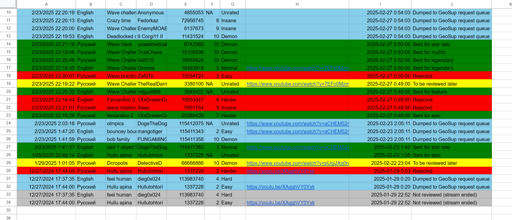

# Request Bot Control Panel

This app is designed to be used in conjunction with [GD Level Request Bot](https://github.com/Gulvan0/RequestBotV2.2/).

The control panel was initially designed as the alternative (and somewhat more convenient) interface for the GD Level Request Bot, hence the name. However, bot control features were postponed. As of now, the primary (and only) purpose of this application is **hosting level review streams**.

Requests are submitted via the [form](https://docs.google.com/forms/d/e/1FAIpQLSdiiNCszrGo6ISM3h8tVcJFa1l9JJ97GAUqiCJn-4yP_Q5Oeg/viewform?usp=header) and are displayed (and stored) in the Google Sheets [spreadsheet](https://docs.google.com/spreadsheets/d/1o162S5-ObUH5twiYT20dVUoKfu38vW1nOZ5rHz-Y6gI/edit?usp=sharing).

## Configuration

All the options are stored in the Options tab and saved automatically.

Stream announcement and conclusion messages are configured in their respective tabs and are also saved automatically.

Stream announcement message is a Jinja2 template. The following variables are available in it:
- `{{ video_link }}` - a link to the stream that has just started
- `{{ form_link }}` - a link to the request submission form (configured in the Options tab)
- `{{ spreadsheet_link }}` - a link to the spreadsheet containing requests

## Spreadsheet Structure

The spreadsheet consists of three sheets.

The first one, `Fresh Responses`, contains unprocessed responses retrieved automatically from the submission form.

Once in a while the bot processes the responses, deleting them from the `Fresh Responses` sheet and moving them into the `Open Requests` sheet. Apart from simply moving the rows from one sheet to another, the bot enriches them with the additional useful information regarding the level, turning them into the complete requests ready to be reviewed.

Every time the request gets resolved, it gets moved from the `Open Requests` sheet to the `Closed Requests` sheet. Two new columns get added to it, namely, the resolution itself and its timestamp. Each row on the `Closed Requests` gets colored depending on the resolution. `Closed Requests` sheet, unlike other sheets, is sorted in the reverse order, with the most recently resolved requests being at the top.

The spreadsheet is adapted to be able to be used across streams preserving all the previous resolutions while also not getting in the way of easily accessing the current stream data.

## Starting the Stream

To enter the streaming mode, press the "Start Stream" button. It will only work if there is a stream active on your channel, either on YouTube (preferred for several reasons) or on Twitch. Both channels are specified in the Options tab. To get the channel ID by channel tag you can use this [service](https://www.tunepocket.com/youtube-channel-id-finder).

As long as the livestream stays the same, the app will go into streamer mode right at startup, without the need to press the button again. This is especially useful since pressing the "Start Stream" button performs additional actions before switching the user to the streaming mode.

The following actions are performed when the stream is started:

1. The form gets cleared from responses and reopened;
2. The announcement message is sent on a Discord server by a bot (turn off the respective route in the bot's settings to disable it);
3. The link to the form is posted to the stream chat (YouTube only!).

The stream chat message with the form link doesn't get pinned due to the limitations of the YouTube API, so you have to do it manually. This is, on the other side, the only action you will need to perform by hand as everything else is handled by the bot.

## Streaming mode

In streaming mode, the stream is picking and resolving the requests using the control panel.

Option buttons in the second row ("Randomly"/"In Sequence") determine how the requests are picked. "Alternate" checkbox, when selected, toggles this choice every time the request is resolved.

Large text window in the middle of the stream contains the details of the currently reviewed level.

Buttons at the bottom are used to send the link to the stream chat again and to wipe all requests that are currently open.

Finally, "Pick First Request" button picks the request. 

Three things should be noted regarding request picking regardless of whether it's the first request on the stream or not.

First, it takes a bit of time (usually about 1-4 seconds) to load the request. At this time, the app may become unresponsive, but the process still continues.

Second, if there's no requests submitted through the form yet, the app will try to take a pending request from the bot (that is, from ones requested on a Discord server).

Third, if the request is picked from the spreadsheet, the app will ask the bot to create the corresponding request on the Discord server for preservation and notification reasons. Any resolution made on stream will also be propagated to the request in Discord.

## Request Reviewing

Once the request is picked, the details get shown in the request details text window. From there, any piece of text can be easily copied, including the ID of the level.

After the level is played and the opinion is expressed, any of the buttons below the details window may be pressed to resolve the request. The app will then resolve the corresponding request on a Discord server notifying the author about the resolution. The link to the stream with the approximate timecode will also be attached to this message (the timecodes are only available on YouTube, if the stream is hosted on Twitch, the link will just point to the streamer's channel).

If a "Later" button is pressed or if the app is accidentally closed, the request on the Discord server will remain open. In the additional comment section, there will be a link to the stream (with a timecode if it's the YouTube stream).

No matter which decision is made, after pressing of the buttons below the request details window, the request is to be moved to the `Closed Requests` sheet with the appropriate resolution and the new request will be picked shortly after.

## Ending the Stream

The button at the top of the "Stream" tab is intended to be pressed when the stream is over (it doesn't matter whether the actual broadcast ended or is going to be stopped right after).

Pressing this button has the following effects:

1. The goodbye message with the stream stats is posted into the corresponding Discord channel (turn off the respective route in the bot to disable posting this message);

2. The submission form is closed;

3. All the remaining requests are moved to the `Closed Requests` sheet;

4. If the checkbox "Dump remaining requests to bot" is selected, those requests will also be requested on the Discord server.

This may take some time. After the app becomes responsive again, it can be safely closed.